## 	Gin简介

### Gin 是什么？

Gin 是一个用 Go (Golang) 编写的 HTTP web 框架。 它是一个类似于 martini 但拥有更好性能的 API 框架，由于 httprouter，速度提高了近 40 倍。如果你需要极好的性能，使用 Gin 吧。

### 如何使用 Gin？

下面罗列了一些众所周知的 Gin 使用者.(感兴趣的可以去一一看看)

- [AsciiJSON](https://gin-gonic.com/zh-cn/docs/examples/ascii-json/)
- [HTML 渲染](https://gin-gonic.com/zh-cn/docs/examples/html-rendering/)
- [HTTP2 server 推送](https://gin-gonic.com/zh-cn/docs/examples/http2-server-push/)
- [JSONP](https://gin-gonic.com/zh-cn/docs/examples/jsonp/)
- [Multipart/Urlencoded 绑定](https://gin-gonic.com/zh-cn/docs/examples/multipart-urlencoded-binding/)
- [Multipart/Urlencoded 表单](https://gin-gonic.com/zh-cn/docs/examples/multipart-urlencoded-form/)
- [PureJSON](https://gin-gonic.com/zh-cn/docs/examples/pure-json/)
- [Query 和 post form](https://gin-gonic.com/zh-cn/docs/examples/query-and-post-form/)
- [SecureJSON](https://gin-gonic.com/zh-cn/docs/examples/secure-json/)
- [XML/JSON/YAML/ProtoBuf 渲染](https://gin-gonic.com/zh-cn/docs/examples/rendering/)
- [安全页眉](https://gin-gonic.com/zh-cn/docs/examples/security-headers/)
- [绑定 HTML 复选框](https://gin-gonic.com/zh-cn/docs/examples/bind-html-checkbox/)
- [绑定 Uri](https://gin-gonic.com/zh-cn/docs/examples/bind-uri/)
- [绑定表单数据至自定义结构体](https://gin-gonic.com/zh-cn/docs/examples/bind-form-data-request-with-custom-struct/)
- [绑定查询字符串或表单数据](https://gin-gonic.com/zh-cn/docs/examples/bind-query-or-post/)
- [不使用默认的中间件](https://gin-gonic.com/zh-cn/docs/examples/without-middleware/)
- [查询字符串参数](https://gin-gonic.com/zh-cn/docs/examples/querystring-param/)
- [从 reader 读取数据](https://gin-gonic.com/zh-cn/docs/examples/serving-data-from-reader/)
- [定义路由日志的格式](https://gin-gonic.com/zh-cn/docs/examples/define-format-for-the-log-of-routes/)
- [多模板](https://gin-gonic.com/zh-cn/docs/examples/multiple-template/)
- [将 request body 绑定到不同的结构体中](https://gin-gonic.com/zh-cn/docs/examples/bind-body-into-dirrerent-structs/)
- [静态文件服务](https://gin-gonic.com/zh-cn/docs/examples/serving-static-files/)
- [静态资源嵌入](https://gin-gonic.com/zh-cn/docs/examples/bind-single-binary-with-template/)
- [控制日志输出颜色](https://gin-gonic.com/zh-cn/docs/examples/controlling-log-output-coloring/)
- [路由参数](https://gin-gonic.com/zh-cn/docs/examples/param-in-path/)
- [路由组](https://gin-gonic.com/zh-cn/docs/examples/grouping-routes/)
- [模型绑定和验证](https://gin-gonic.com/zh-cn/docs/examples/binding-and-validation/)
- [如何记录日志](https://gin-gonic.com/zh-cn/docs/examples/write-log/)
- [上传文件](https://gin-gonic.com/zh-cn/docs/examples/upload-file/)
- [设置和获取 Cookie](https://gin-gonic.com/zh-cn/docs/examples/cookie/)
- [使用 BasicAuth 中间件](https://gin-gonic.com/zh-cn/docs/examples/using-basicauth-middleware/)
- [使用 HTTP 方法](https://gin-gonic.com/zh-cn/docs/examples/http-method/)
- [使用中间件](https://gin-gonic.com/zh-cn/docs/examples/using-middleware/)
- [映射查询字符串或表单参数](https://gin-gonic.com/zh-cn/docs/examples/map-as-querystring-or-postform/)
- [优雅地重启或停止](https://gin-gonic.com/zh-cn/docs/examples/graceful-restart-or-stop/)
- [运行多个服务](https://gin-gonic.com/zh-cn/docs/examples/run-multiple-service/)
- [在中间件中使用 Goroutine](https://gin-gonic.com/zh-cn/docs/examples/goroutines-inside-a-middleware/)
- [支持 Let's Encrypt](https://gin-gonic.com/zh-cn/docs/examples/support-lets-encrypt/)
- [只绑定 url 查询字符串](https://gin-gonic.com/zh-cn/docs/examples/only-bind-query-string/)
- [重定向](https://gin-gonic.com/zh-cn/docs/examples/redirects/)
- [自定义 HTTP 配置](https://gin-gonic.com/zh-cn/docs/examples/custom-http-config/)
- [自定义日志文件](https://gin-gonic.com/zh-cn/docs/examples/custom-log-format/)
- [自定义验证器](https://gin-gonic.com/zh-cn/docs/examples/custom-validators/)
- [自定义中间件](https://gin-gonic.com/zh-cn/docs/examples/custom-middleware/)

## Hello_Gin

```go
package main

import "github.com/gin-gonic/gin"

// 导入gin包

func main() {
	r := gin.Default() // 创建一个默认的路由引擎（创建中间件）
	r.GET("/hello", func(c *gin.Context) {
		c.JSON(200, gin.H{
			"message": "Hello, World! This is a Gin server.",
		})
	})
	// 创建一个GET路由，访问/hello时，返回json数据
	r.Run(":28081")
	// 运行服务不加:28081则默认在8080
}

// 使用gin很简单就启动了一个http服务
```

> 很轻松就创建了一个go的HTTP服务，当127.0.0.1:28081后面接入/hello的时候就会返回一段JSON文本，如下所示
>
> 当然就单纯访问 127.0.0.1:28081 会出现404 page not found  ：： 404也说明了后端服务已经启动好了


## 四种常见请求

示例：

```go
package main

import (
    "github.com/gin-gonic/gin"
)

func main() {
    router := gin.Default()

    // Handle GET request at /someGet
    router.GET("/someGet", func(c *gin.Context) {
        c.String(200, "GET")
    })

    // Handle POST request at /somePost
    router.POST("/somePost", func(c *gin.Context) {
        c.String(200, "POST")
    })

    // Handle PUT request at /somePut
    router.PUT("/somePut", func(c *gin.Context) {
        c.String(200, "PUT")
    })

    // Handle DELETE request at /someDelete
    router.DELETE("/someDelete", func(c *gin.Context) {
        c.String(200, "DELETE")
    })

    // Handle PATCH request at /somePatch
    router.PATCH("/somePatch", func(c *gin.Context) {
        c.String(200, "PATCH")
    })

    router.Run(":3000")
}
// 建议自己访问试试吧
/*
http://localhost:3000/someGet
http://localhost:3000/somePost
http://localhost:3000/somePut
http://localhost:3000/someDelete
*/
```

1. **GET**：GET 方法用于获取资源。它只应用于安全和幂等的操作，这意味着多次执行同一 GET 请求应该返回相同的结果，并且不会改变服务器上的资源状态。
2. **POST**：POST 方法用于发送数据到服务器，通常用于创建新的资源。POST 不是幂等的，这意味着多次执行同一 POST 请求可能会得到不同的结果。
3. **PUT**：PUT 方法用于更新资源。它是幂等的，这意味着无论你执行多少次 PUT 请求，结果都是相同的。通常，PUT 请求会包含一个资源的完整更新。
4. **DELETE**：DELETE 方法用于删除资源。它是幂等的，这意味着无论你执行多少次 DELETE 请求，结果都是相同的。

```go
package main

import (
	"github.com/gin-gonic/gin"
)

func main() {
	r := gin.Default() // 创建一个默认的路由引擎（创建中间件）

	// 创建一个GET路由
	r.GET("/path/:id", func(c *gin.Context) {
		id := c.Param("id")
		user := c.Query("user")
		pwd := c.Query("pwd") // 这里区分下Param和Query
		c.JSON(200, gin.H{
			"message": "Hello, World! This is a GET request.",
			"id":      id,
			"user":    user,
			"pwd":     pwd,
		})
	})

	// 创建一个POST路由
	r.POST("/path", func(c *gin.Context) {
		c.JSON(200, gin.H{
			"message": "Hello, World! This is a POST request.",
		})
	})

	// 创建一个PUT路由
	r.PUT("/path", func(c *gin.Context) {
		c.JSON(200, gin.H{
			"message": "Hello, World! This is a PUT request.",
		})
	})

	// 创建一个DELETE路由
	r.DELETE("/path/:id", func(c *gin.Context) {
		c.JSON(200, gin.H{
			"message": "Hello, World! This is a DELETE request.",
		})
	})
	// 通过gin生成四种基本HTTP服务

	r.Run(":28081") // 运行服务不加:28081则默认在8080
}
```

显示结果如下：

GET示例：


DELETE示例；


其他的自己动手去试试看吧	

## Bind绑定

流程图如下：


### POST -> Body

```go
package main

import (
	"github.com/gin-gonic/gin"
)

type PostParams struct {
	Name string `json:"name"`
	Age  int    `json:"age"`
	Sex  string `json:"sex"`
}

// bind绑定的是body体中的数据，如果是get请求，那么就是url中的数据

func main() {
	r := gin.Default()
	r.POST("/testBind", func(c *gin.Context) {
		var p PostParams
		err := c.ShouldBind(&p)
		if err != nil {
			c.JSON(400, gin.H{
				"error": err.Error(), // 报错打印err值
			})
		} else {
			c.JSON(200, gin.H{
				"msg":  "success",
				"name": p.Name,
				"age":  p.Age,
				"sex":  p.Sex,
			})
		}
	})

	r.Run(":20082")
}

```

结果如下：


### PUT -> Uri

```go
package main

import (
	"github.com/gin-gonic/gin"
)

type PostParams struct {
	Name string `json:"name" uri:"name"`
	Age  int    `json:"age" uri:"age"`
	Sex  string `json:"sex" uri:"sex"`
}

// 增加（修改）这里同时可以进行PUT绑定

func main() {
	r := gin.Default()
	r.PUT("/testBind/:name/:age/:sex", func(c *gin.Context) {
		var p PostParams
		err := c.ShouldBindUri(&p)
		if err != nil {
			c.JSON(400, gin.H{
				"error": err.Error(),
			})
		} else {
			c.JSON(200, gin.H{
				"msg":  "success",
				"name": p.Name,
				"age":  p.Age,
				"sex":  p.Sex,
			})
		}
	})

	r.Run(":20082")
}
```

结果如下：


### PUT -> Url

```go
package main

import (
    "github.com/gin-gonic/gin"
)

type PostParams struct {
    Name string `form:"name" json:"name" uri:"name"`
    Age  int    `form:"age" json:"age" uri:"age"`
    Sex  string `form:"sex" json:"sex" uri:"sex"`
}

func main() {
    r := gin.Default()
    r.PUT("/testBind", func(c *gin.Context) {
        var p PostParams
        err := c.ShouldBindQuery(&p)
        if err != nil {
            c.JSON(400, gin.H{
                "error": err.Error(),
            })
        } else {
            c.JSON(200, gin.H{
                "msg":  "success",
                "name": p.Name,
                "age":  p.Age,
                "sex":  p.Sex,
            })
        }
    })

    r.Run(":20082")
}
```

结果如下：


> 可见这里PostParams同时有三张属性即可绑定上面的三种请求
>
> 但是注意路径是/testBind还是/testBind/:name/:age/:sex

### JSON表单验证

```
package main

import (
	"github.com/gin-gonic/gin"
	"github.com/gin-gonic/gin/binding"
	"github.com/go-playground/validator/v10"
)

type PostParams struct {
	Name string `json:"name"`
	Age  int    `json:"age" binding:"required,mustBig"`
	Sex  string `json:"sex"`
}

func mustBig(f1 validator.FieldLevel) bool {
	if f1.Field().Interface().(int) <= 18 { // reflect类型断言转为int
		return false
	}
	return true
}

//  validator.FieldLevel是一个接口，通常用于自定义验证函数

// 简化如下：
/*
	func mustBig(f1 validator.FieldLevel) bool {
			return f1.Field().Interface().(int) > 18
	}
*/

func main() {
	r := gin.Default()
	r.POST("/test", func(c *gin.Context) {
		if v, ok := binding.Validator.Engine().(*validator.Validate); ok {
			v.RegisterValidation("mustBig", mustBig)
		}
		// 注册自定义验证函数 先给v注册断言然后绑定标签和方法  主要就是绑定了mustBig标签才能实现精确锁定位置
		var p PostParams
		err := c.ShouldBindJSON(&p)
		if err != nil {
			c.JSON(200, gin.H{
				"data": gin.H{"err": err.Error()}, // gin.H像是将JSON封装返回去
				"msg":  "年龄错误了",
			})
		} else {
			c.JSON(200, gin.H{
				"data": p,
				"msg":  "ok",
			})
		}
	})
	r.Run(":3081")
}
```

正确结果如下：


验证失败则如下：


> 简单来说就是年龄值违背了自定义验证器

### 表单验证

```go
package main

import (
	"github.com/gin-gonic/gin"
	"github.com/gin-gonic/gin/binding"
	"github.com/go-playground/validator/v10"
)

type PostParams struct {
	Name string `form:"name"`
	Age  int    `form:"age" binding:"required,mustBig"`
	Sex  string `form:"sex"`
}

func mustBig(f1 validator.FieldLevel) bool {
	return f1.Field().Interface().(int) > 18
}

func main() {
	r := gin.Default()
	r.POST("/test", func(c *gin.Context) {
		if v, ok := binding.Validator.Engine().(*validator.Validate); ok {
			v.RegisterValidation("mustBig", mustBig)
		}
		var p PostParams
		err := c.ShouldBind(&p)  // 这里是ShouldBind那么就是绑定表单验证了
		if err != nil {
			c.JSON(200, gin.H{
				"data": gin.H{"err": err.Error()},
				"msg":  "年龄错误了",
			})
		} else {
			c.JSON(200, gin.H{
				"data": p,
				"msg":  "ok",
			})
		}
	})
	r.Run(":3081")
}
```

## 文件处理


### 用SaveUploadedFile保存文件

```go
package main

import (
	"github.com/gin-gonic/gin"
)

func main() {
	r := gin.Default()

	r.POST("/test", func(c *gin.Context) {
		file, _ := c.FormFile("file")
		c.SaveUploadedFile(file, "./"+file.Filename)
		c.JSON(200, gin.H{
			"message": file, // 查看file的信息
		})
	})
	r.Run(":1234")
}
// 因为是自己测试 所以先忽略错误的情况
```

结果如下：


> 鉴于apipost上传有问题故切换为postman


> 可见文件被正常保存起来了

### 用IO操作保存文件

修改之后的代码时这样的：
```go
package main

import (
	"io"
	"os"

	"github.com/gin-gonic/gin"
)

func main() {
	r := gin.Default()
	r.POST("/test", func(c *gin.Context) {
		file, _ := c.FormFile("file")
		in, _ := file.Open()
		defer in.Close()
		out, _ := os.Create("./" + file.Filename)
		defer out.Close()
		io.Copy(out, in)
        // 注意这5行in/out操作
		c.JSON(200, gin.H{
			"message": file, // 查看file的信息
		})
        // 这里先提前说明下这里表示后端返回的时JSON数据
	})
	r.Run(":1234")
}
```

### 后端接收且返回文件

```go
package main

import (
	"io"
	"os"

	"github.com/gin-gonic/gin"
)

func main() {
	r := gin.Default()
	r.POST("/test", func(c *gin.Context) {
		file, _ := c.FormFile("file")
		in, _ := file.Open()
		defer in.Close()
		out, _ := os.Create("./" + file.Filename)
		defer out.Close()
		io.Copy(out, in)
		c.Writer.Header().Add("Content-Disposition", "attachment; filename="+file.Filename)
		c.File("./" + file.Filename)
        // 这里区别于前面下：返回的是file
	})
	r.Run(":1234")
}
```

结果如下：


> 解释如下：
>
> 第一行代码 `c.Writer.Header().Add("Content-Disposition", "attachment; filename="+file.Filename)` 是在 HTTP 响应头中添加了一个 "Content-Disposition" 字段。这个字段的值为 "attachment; filename="+file.Filename，意思是告诉客户端，这个响应包含的内容应该被视为一个附件，下载下来并以 file.Filename 为文件名保存。
>
> 第二行代码 `c.File("./" + file.Filename)` 是将文件的内容写入到 HTTP 响应体中。这个文件的路径是当前目录（"./"）加上文件名（file.Filename）。`c.File` 方法会自动设置正确的 `Content-Type` 响应头，根据文件的扩展名来确定文件的 MIME 类型。
>
> > 也就是前面一行是设置响应头 后面一行是设置响应体


上传图片之类的文件也是可以的

### 多文件处理

```go
```

注意Key依旧是file：


如果Key不是file那么就会像上面一样出现空括号。

## 路由和分组


```go
package main

import (
	"fmt"
	"github.com/gin-gonic/gin"
)

func main() {
	r := gin.Default()
	v1 := r.Group("v1")
	v1.GET("test", func(c *gin.Context) {
		fmt.Println("我在分组v1里面")
		c.JSON(200, gin.H{
			"message": "test",
		})
	})
	r.Run(":1234")
}
```

分组路由返回信息如下：


> 注意这里是GET请求不是POST请求

### 中间件

```go
package main

import (
	"fmt"

	"github.com/gin-gonic/gin"
)

func middle() gin.HandlerFunc {
	return func(c *gin.Context) {
		fmt.Println("我在方法前")
		c.Next()
		fmt.Println("我在方法后")
	}
}
// 创建中间件：注意参数

func main() {
	r := gin.Default()
	v1 := r.Group("v1").Use(middle())
	v1.GET("test", func(c *gin.Context) {
		fmt.Println("我在分组v1内部")
		c.JSON(200, gin.H{
			"message": "testSuccess",
		})
	})
	r.Run(":1234")
}
```

结果如下：


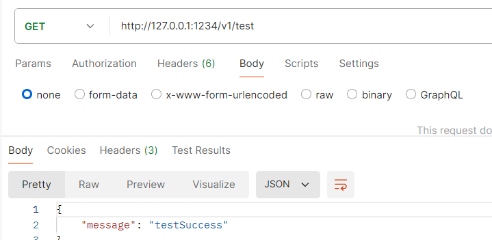

> 中间件：洋葱结构：核心是 比如说这一段
>
> ```go
> fmt.Println("我在分组v1内部")
>     c.JSON(200, gin.H{
>         "message": "testSuccess",
> })
> ```

### 多个中间件

```go
package main

import (
	"fmt"

	"github.com/gin-gonic/gin"
)

func firstMiddle() gin.HandlerFunc {
	return func(c *gin.Context) {
		fmt.Println("我在第一个中间件前")
		c.Next()
		fmt.Println("我在第一个中间件后")
	}
}

func secondMiddle() gin.HandlerFunc {
	return func(c *gin.Context) {
		fmt.Println("我在第二个中间件前")
		c.Next()
		fmt.Println("我在第二个中间件后")
	}
}

func main() {
	r := gin.Default()
	v1 := r.Group("v1")
	v1.Use(firstMiddle(), secondMiddle())
	v1.GET("test", func(c *gin.Context) {
		fmt.Println("我在分组v1内部")
		c.JSON(200, gin.H{
			"message": "testSuccess",
		})
	})
	r.Run(":1234")
}
```

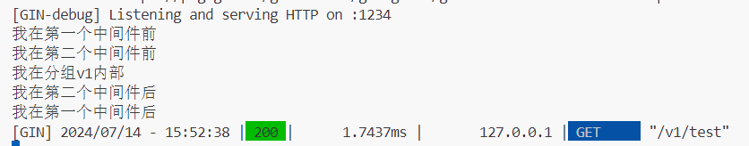

## 日志

### Gin日志组件


```go
package main

import (
	"io"
	"os"

	"github.com/gin-gonic/gin"
)

func main() {
	// 禁用控制台颜色
	//gin.DisableConsoleColor()

	// 创建记录日志的文件
	f, _ := os.Create("gin.log")
	gin.DefaultWriter = io.MultiWriter(f)

	// 如果需要将日志同时写入文件和控制台，请使用以下代码
	// gin.DefaultWriter = io.MultiWriter(f, os.Stdout)

	router := gin.Default()
	router.GET("/ping", func(c *gin.Context) {
		c.String(200, "pong")
	})

	router.Run(":1234")
}
```

只从成功之后当前文件夹中就多了个log文件：


#### 追加日志信息

```go
package main

import (
	"io"
	"os"

	"github.com/gin-gonic/gin"
)

func main() {
	// 创建或打开日志文件，如果文件已存在，将在文件末尾添加内容
	f, _ := os.OpenFile("gin.log", os.O_WRONLY|os.O_CREATE|os.O_APPEND, 0644)
	gin.DefaultWriter = io.MultiWriter(f)

	router := gin.Default()
	router.GET("/ping", func(c *gin.Context) {
		c.String(200, "pong")
	})
	router.Run(":1234")
}
```

> 也就是f的os那里需要处理和修改，后面也就是直接wirte即可
>
> > `0644` 表示创建的文件，文件的所有者有读写权限，而同一组的其他用户和其他所有用户只有读权限
>
> os.O_WRONLY|os.O_CREATE|os.O_APPEND
>
> 只读|创建|追加

#### 按日期保存

> 对于源代码修改这里就行了

```
// 获取当前日期
currentTime := time.Now()

// 格式化日期并用于文件名
logFileName := fmt.Sprintf("gin_%s.log", currentTime.Format("2006-01-02"))  // 格式化
// 核心就是这里创建log文件了

// 创建或打开日志文件，如果文件已存在，将在文件末尾添加内容
f, _ := os.OpenFile(logFileName, os.O_WRONLY|os.O_CREATE|os.O_APPEND, 0644)
gin.DefaultWriter = io.MultiWriter(f)
// 惯例打开然后写入即可
```

### 自定义日志格式

```go
package main

import (
	"fmt"
	"io"
	"os"
	"time"

	"github.com/gin-gonic/gin"
)

func main() {
	// 获取当前日期
	currentTime := time.Now()

	// 格式化日期并用于文件名：：不使用filename也可以自定义filenam'e
	logFileName := fmt.Sprintf("gin_%s.log", currentTime.Format("2006-01-02"))

	// 创建或打开日志文件，如果文件已存在，将在文件末尾添加内容
	f, _ := os.OpenFile(logFileName, os.O_WRONLY|os.O_CREATE|os.O_APPEND, 0644)
	gin.DefaultWriter = io.MultiWriter(f)

	router := gin.Default()
	router.Use(gin.LoggerWithFormatter(func(param gin.LogFormatterParams) string {
		// your custom format
		return fmt.Sprintf("%s - [%s] \"%s %s %s %d %s \"%s\" %s\"\n",
			param.ClientIP,
			param.TimeStamp.Format(time.RFC1123),
			param.Method,
			param.Path,
			param.Request.Proto,
			param.StatusCode,
			param.Latency,
			param.Request.UserAgent(),
			param.ErrorMessage,
		)
		// 这里注意稍微看看自定义日志的格式
	}))
	router.Use(gin.Recovery())

	router.GET("/ping", func(c *gin.Context) {
		c.String(200, "pong")
	})

	router.Run(":1234")
}

```

结果如下：是没什么问题的：可以将控制台的日志也打印出来

> 使用这行：gin.DefaultWriter = io.MultiWriter(f, os.Stdout)

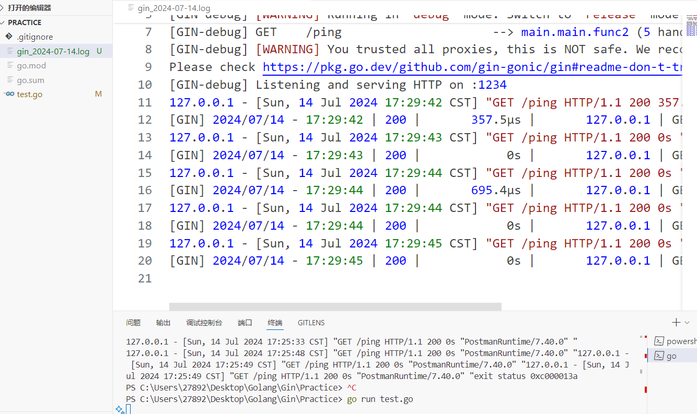

## 数据库操作GORM

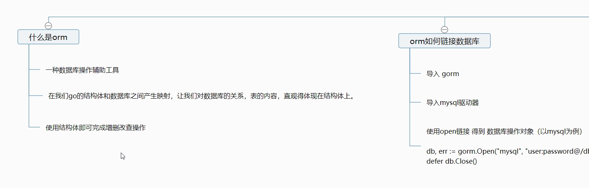


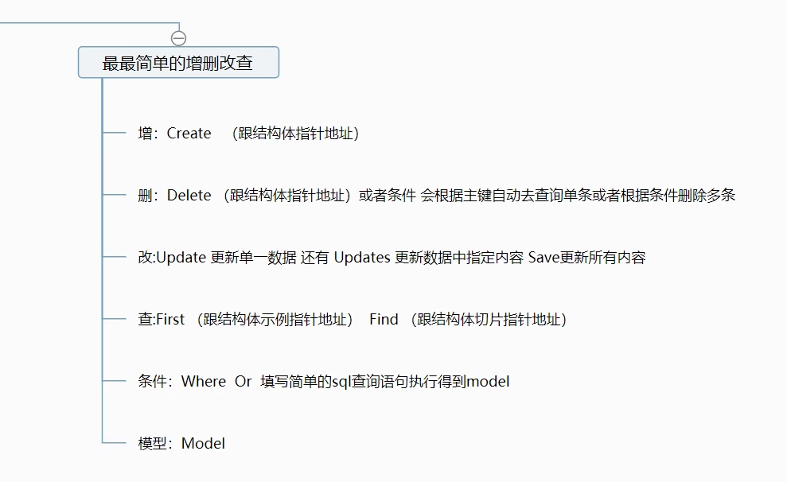

### 连接及其简单的创建表和数据项

```go
package main

import (
	"fmt"
	"github.com/jinzhu/gorm"
	_ "github.com/jinzhu/gorm/dialects/mysql"
)

type HelloWorld struct {
	gorm.Model // gorm.Model 是一个包含ID、CreatedAt、UpdatedAt、DeletedAt的结构体，可以嵌入你的model
	Name       string
	Sex        string
	Age        int
}

func main() {
	db, err := gorm.Open("mysql", "用户名:密码@tcp(服务器IP地址:3306)/gin?charset=utf8mb4&parseTime=True&loc=Local")
	if err != nil {
		fmt.Println("Failed to connect to database")
		panic(err)
	} else {
		fmt.Println("建立连接成功")
	}
	defer db.Close()              // defer关闭
	db.AutoMigrate(&HelloWorld{}) // 自动建表格
	db.Create(&HelloWorld{
		Name: "mobai",
		Sex:  "boy",
		Age:  18,
	})
    // 建立数据项
}
```

结果如下：
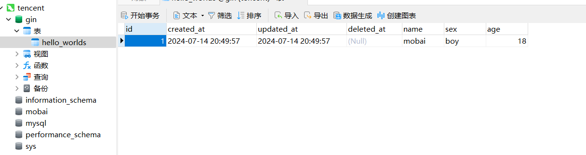

### 基本操作

#### 增

```go
db.Create(&HelloWorld{
    Name: "mobaia2",
    Sex:  "boy",
    Age:  19,
})
```

#### 删

```go
result := db.Where("id = ?", 1).Delete(&HelloWorld{})
if result.Error != nil {
    fmt.Println("删除失败:", result.Error)
} else {
    fmt.Println("删除成功")
}
```

结果如下：
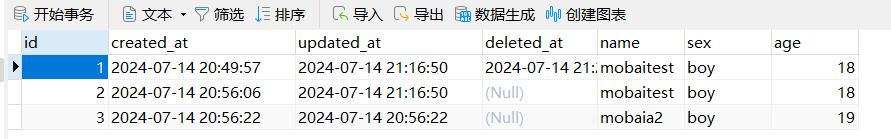

示例2：

```go
result := db.Where("id = ?", 1).Unscoped().Delete(&HelloWorld{})
if result.Error != nil {
    fmt.Println("删除失败:", result.Error)
} else {
    fmt.Println("删除成功")
}
```

结果如下：
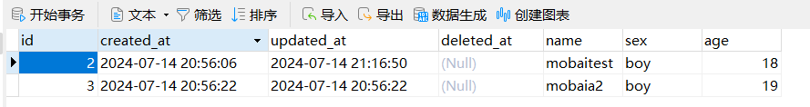

#### 改

示例1；

```go
var hw HelloWorld
result := db.Where("id = ?", 1).First(&hw).Updates(HelloWorld{Name: "mobaisilent"})
if result.Error != nil {
    fmt.Println("更新失败:", result.Error)
} else {
    fmt.Println("更新成功")
}
```

结果如下：
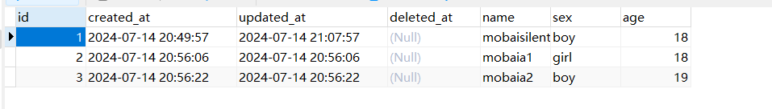

示例2：

```go
result := db.Model(&HelloWorld{}).Where("id IN (?)", []int{1, 2}).Updates(map[string]interface{}{
    "Name": "mobaitest",
    "Sex":  "boy",
    "Age":  18,
})
if result.Error != nil {
    fmt.Println("更新失败:", result.Error)
} else {
    fmt.Println("更新成功")
}
```

结果如下：
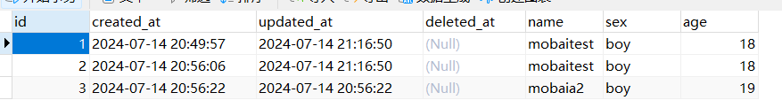

#### 查

示例1：

```go
var hello []HelloWorld
db.Where("age < ?", 20).Find(&hello)
fmt.Println(hello)
```

结果如下：
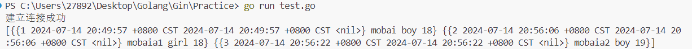

示例2：

```go
var hello HelloWorld
db.First(&hello, "sex = ?", "girl")
fmt.Println(hello)
```

结果如下：
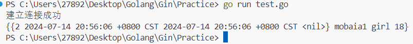

## GORM结构体

> 参考资料：
>
> https://gorm.io/zh_CN/docs/index.html
>
> https://jasperxu.github.io/gorm-zh/
>
> https://learnku.com/docs/gorm/v1/index/3781

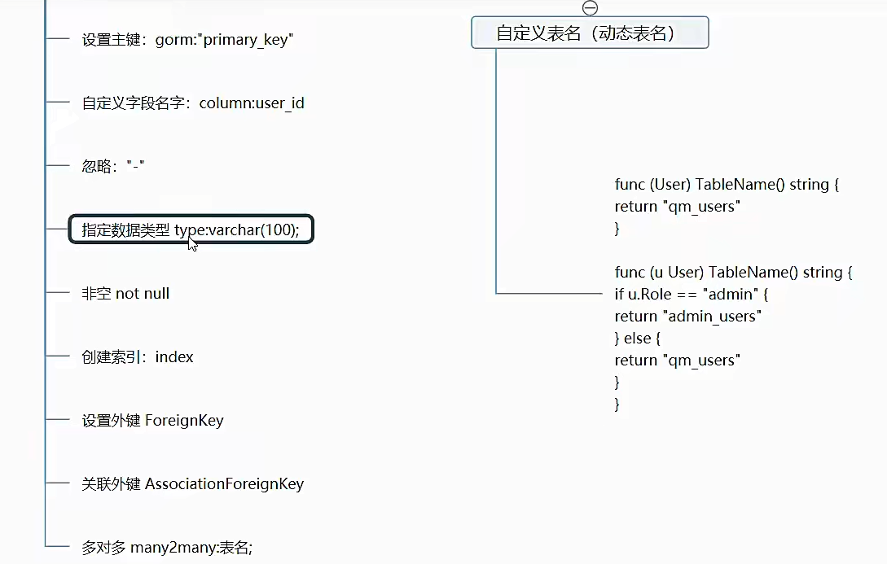

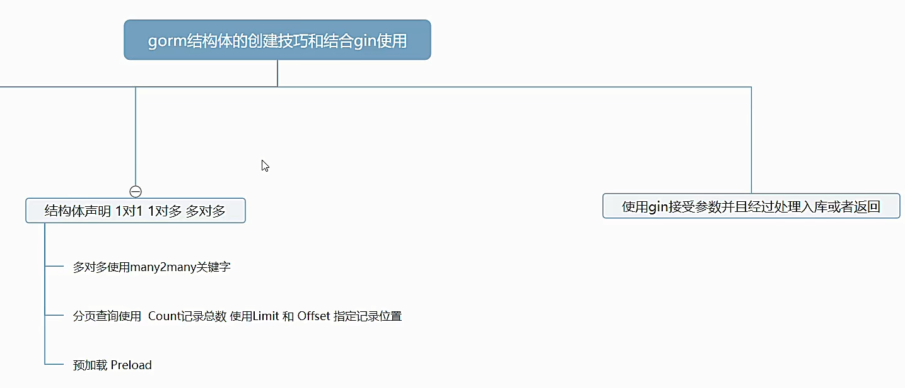

### 更具gorm属性建立列项

测试示例代码；

```go
package main

import (
	"fmt"
	"github.com/jinzhu/gorm"
	_ "github.com/jinzhu/gorm/dialects/mysql"
	// 有了_ 编译器就不会因为没有使用这个包而报错
)

type User struct {
	gorm.Model        // gorm表的几个基本属性
	Name       string `gorm:"column:user_name;type:varchar(100);primary_key"`
}

func main() {
	db, err := gorm.Open("mysql", "root:mobaisilent@tcp(122.51.14.13:3306)/gin?charset=utf8&parseTime=True&loc=Local")
	if err != nil {
		fmt.Println("Failed to connect to database:", err)
		return
	} else {
		fmt.Println("连接成功，开始创建表")
	}
	db.AutoMigrate(&User{}) // 自动创建上面定义的表
	defer db.Close()
}

// 根据字段自定义表段
```

设计的表的结构如下：
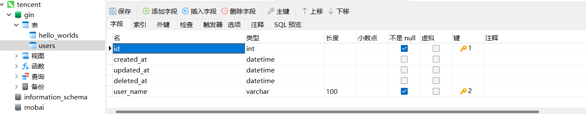

> 注意：
> `gorm:"column:user_name;type:varchar(100);primary_key"`这行的一些关键字的位置是可以i陶正的
>
> 比如：
>
> `gorm:"primary_key;column:user_name;type:varchar(100)"`
>
> 推吧primary_key放到最后面符合一般创建表的思维
>
> Name可以看作是go机构体中的属性，然后后面的字段就看着实Name在数据库中的字段  就将两者练习起来了

### 表关系：多对多关系

> 使用many2many创建多对多关系的表

```go
package main

import (
	"fmt"
	"github.com/jinzhu/gorm"
	_ "github.com/jinzhu/gorm/dialects/mysql"
)

type Student struct {
	gorm.Model
	Teachers []Teacher `gorm:"many2many:student_teachers"`
	IDcards  []IDcard  // 表示一个学生有多个老师√和IDcards？
}

type Teacher struct {
	gorm.Model
	Students []Student `gorm:"many2many:student_teachers"`
    // 表示一个老师可以有多个学生
}

type IDcard struct {
	gorm.Model
	StudentID uint
	Num       int
}

func main() {
	db, err := gorm.Open("mysql", "root:mobaisilent@tcp(122.51.14.13:3306)/gin?charset=utf8&parseTime=True&loc=Local")
	if err != nil {
		fmt.Println("Failed to connect to database:", err)
		return
	} else {
		fmt.Println("连接数据库成功")
	}
	defer db.Close()

	db.AutoMigrate(&Student{}, &Teacher{}, &IDcard{})
}
```

结果如下：(创建的多对关系的表如下：可见关系表)

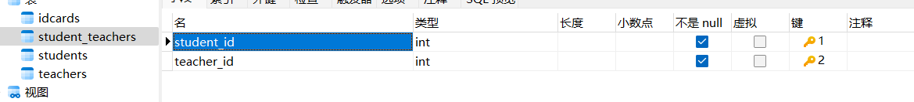

解释如下：

- `Student` 表：每个 `Student` 记录代表一个学生。它有一个 `Teachers` 字段，表示一个学生可以有多个老师。这是通过 `gorm:"many2many:student_teachers"` 标签实现的，GORM 会自动创建一个 `student_teachers` 表来存储 `Students` 和 `Teachers` 的多对多关系。`IDcards` 字段表示一个学生可以有多个 ID 卡。
- `Teacher` 表：每个 `Teacher` 记录代表一个老师。它有一个 `Students` 字段，表示一个老师可以教多个学生。这也是通过 `gorm:"many2many:student_teachers"` 标签实现的。
- `IDcard` 表：每个 `IDcard` 记录代表一个 ID 卡。它有一个 `StudentID` 字段，表示每个 ID 卡都属于一个学生。

> 理一下这三个结构体所创建的表的关系：（三个表的结构如下）
>
> students
> - ID
> - CreatedAt
> - UpdatedAt
> - DeletedAt
>
> teachers
> - ID
> - CreatedAt
> - UpdatedAt
> - DeletedAt
>
> student_teachers
> - student_id
> - teacher_id
>
> idcards
> - ID
> - CreatedAt
> - UpdatedAt
> - DeletedAt
> - StudentID
> - Num

### 复杂和合实例化

示例代码：（创建一个数据库表的对象）
```go
package main

import (
	"fmt"
	"github.com/jinzhu/gorm"
	_ "github.com/jinzhu/gorm/dialects/mysql"
)

type Class struct {
	gorm.Model
	ClassName string
	Students  []Student
}

type Student struct {
	gorm.Model
	ClassID  uint
	Name     string
	Teachers []Teacher `gorm:"many2many:student_teachers"`
	IDcards  IDcard
}

type Teacher struct {
	gorm.Model
	Name     string
	Students []Student `gorm:"many2many:student_teachers"`
}

type IDcard struct {
	gorm.Model
	StudentID uint
	Num       int
}

func main() {
	db, err := gorm.Open("mysql", "root:mobaisilent@tcp(122.51.14.13:3306)/gin?charset=utf8&parseTime=True&loc=Local")
	if err != nil {
		fmt.Println("Failed to connect to database:", err)
		return
	} else {
		fmt.Println("连接数据库成功")
	}
	defer db.Close()

	db.AutoMigrate(&Class{}, &Student{}, &Teacher{}, &IDcard{})

	t := Teacher{
		Name: "张老师",
	}
	db.Create(&t)

	card := IDcard{
		Num: 123456,
	}
    db.Create(&card)

	s := Student{
		Name:     "小明",
		Teachers: []Teacher{t},
		IDcards:  card,
	}
	db.Create(&s)

	c := Class{
		ClassName: "qimiao",
		Students:  []Student{s},
	}
	db.Create(&c)
}

```

结果如下：（其他表略）

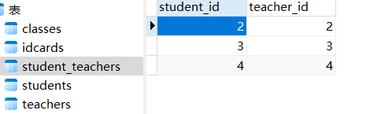

### 结合gin的应用

> 实现数据库的后端应用

示例代码：
```go
package main

import (
	"fmt"

	"github.com/gin-gonic/gin"
	"github.com/jinzhu/gorm"
	_ "github.com/jinzhu/gorm/dialects/mysql"
)

type Class struct {
	gorm.Model
	ClassName string
	Students  []Student
}

type Student struct {
	gorm.Model
	ClassID  uint
	Name     string
	Teachers []Teacher `gorm:"many2many:student_teachers"`
	IDcards  IDcard
}

type Teacher struct {
	gorm.Model
	Name     string
	Students []Student `gorm:"many2many:student_teachers"`
}

type IDcard struct {
	gorm.Model
	StudentID uint
	Num       int
}

func main() {
	db, err := gorm.Open("mysql", "root:mobaisilent@tcp(122.51.14.13:3306)/gin?charset=utf8&parseTime=True&loc=Local")
	if err != nil {
		fmt.Println("Failed to connect to database:", err)
		return
	} else {
		fmt.Println("连接数据库成功")
	}
	defer db.Close()

	r := gin.Default()
	// 使用中间件

	r.GET("/student/:ID", func(c *gin.Context) {
		id := c.Param("ID") // 获取参数
		var student Student
		db.Preload("Teachers").Preload("IDcards").First(&student, "id = ?", id)
		c.JSON(200, gin.H{
			"student": student,
		})
	})

	r.GET("/class/:ID", func(c *gin.Context) {
		id := c.Param("ID")
		var class Class
		db.Preload("Students").Preload("Students.Teachers").Preload("Students.IDcards").First(&class, "id = ?", id)
		c.JSON(200, gin.H{
			"class": class,
		})
	})

	r.Run(":8888")
}
```

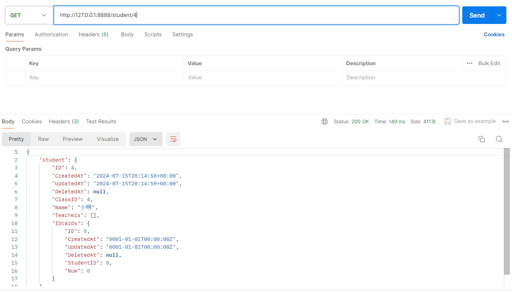

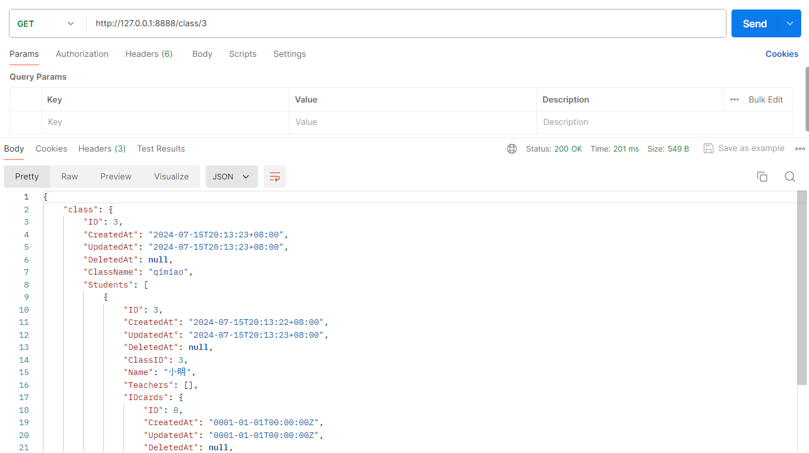

> 关于preload：
>
> `Preload` 是用来执行预加载操作的。预加载是一种性能优化技术，它可以在查询一个对象时，同时查询该对象关联的其他对象。

## JWT包

> jsoon web token


